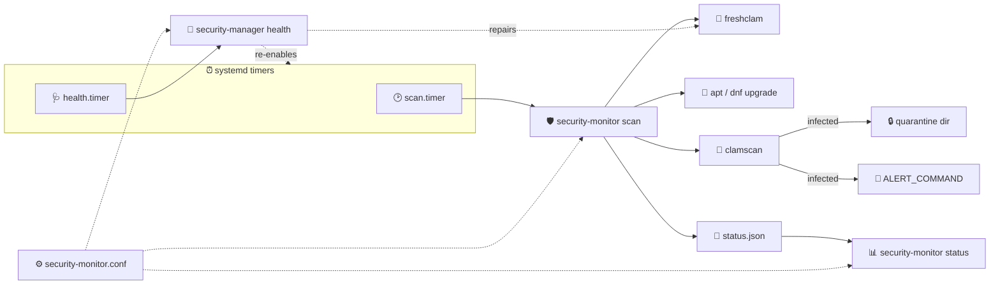
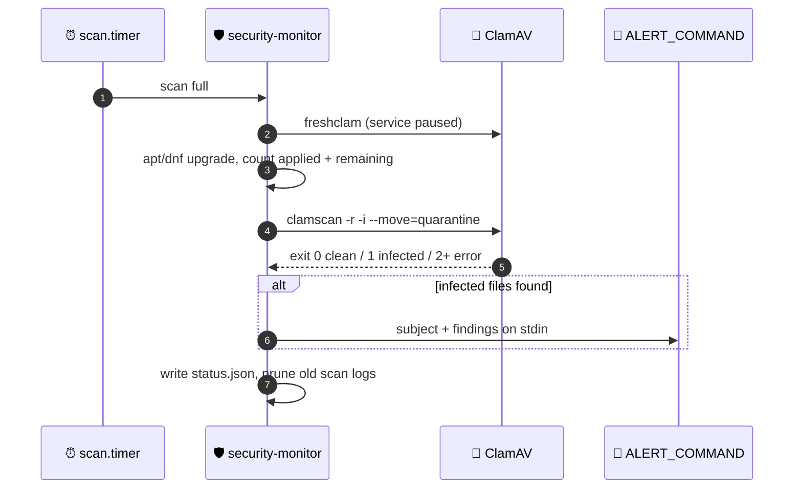

<div align="center">

# 🛡️ EC2 - Linux Security Monitor

**ClamAV malware scanning with quarantine and alerting, automatic security updates, and a terminal status dashboard for systemd Linux — built for EC2, tested on Ubuntu and Amazon Linux**


[](https://github.com/CaputoDavide93/EC2-Linux-Security-Monitor/actions/workflows/lint.yml)

[Features](#-features) • [Quick Start](#-quick-start) • [Usage](#-usage) • [Testing](#-testing) • [Contributing](#-contributing)

</div>

---

## ✨ Features

| | Feature | What it does |
|---|---------|--------------|
| 🦠 | **ClamAV scanning** | Quick (30–90 s) or full (10–30 min) `clamscan` sweeps, non-existent paths skipped automatically |
| 🔒 | **Quarantine** | Infected files are *moved* (never deleted) to a `0700` root-owned directory, excluded from later scans |
| 📣 | **Alerting** | Runs your `ALERT_COMMAND` with the findings on stdin — mail, SNS, Slack webhook, anything |
| 🔄 | **Auto updates** | Applies pending updates during every scan (apt / dnf) and reports applied vs still-available |
| 🧬 | **Fresh definitions** | Runs `freshclam` before each scan, pausing the service so it can't hold the database lock |
| 📊 | **Status dashboard** | Real state only: scan freshness, 5-point compliance score, services, signature version and age |
| ⏰ | **systemd timers** | Daily scan + 6-hourly health check, `Persistent=true` so a stopped instance catches up |
| 🩺 | **Self-healing health check** | Restarts dead services, refreshes stale definitions, re-enables stopped timers |
| ⚙️ | **Single config file** | One `/etc/security-monitor/security-monitor.conf` drives behaviour *and* what the dashboard reports |
| 📝 | **Managed logs** | Logrotate for the service logs, age-based pruning for per-scan logs, status as JSON |

---

## 🗺️ Architecture

Two scripts. `security-manager` installs and maintains; `security-monitor` scans and reports.
Both read the same config file, so a schedule or path is stated in exactly one place.



A single scan runs three steps, then persists a result the dashboard can read:



---

## 📋 Prerequisites

| Requirement | Notes |
|-------------|-------|
| Linux + systemd | Timers and services are managed with `systemctl`; `install` refuses to run without it |
| Bash 4.0+ | Both scripts are pure Bash |
| Root access | `install`, `uninstall`, `health`, and `scan` need root. `status` does **not** |
| Internet access | To download ClamAV packages and virus definitions |

### Supported distributions

✅ **Ubuntu / Debian** (`apt`, `unattended-upgrades`) — ✅ **Amazon Linux 2023** (`dnf`, `dnf-automatic`)

`install` refuses anything else with `Unsupported operating system`. The scan and dashboard
code also recognises `rhel`/`centos`/`fedora` for service and package-manager naming, but
those are untested and the installer won't set them up.

---

## 🚀 Quick Start

```bash
git clone https://github.com/CaputoDavide93/EC2-Linux-Security-Monitor.git
cd EC2-Linux-Security-Monitor
chmod +x security-monitor.sh security-manager.sh
sudo ./security-manager.sh install
```

The installer runs nine steps: package lists, ClamAV + `jq` + `curl` + auto-update tooling,
ClamAV configuration, unattended updates, the config file, logrotate, both scripts into
`/usr/local/bin`, the systemd timers, and the shell shortcuts.

Then reload your shell to pick up the shortcuts:

```bash
source /etc/profile.d/security-monitor.sh
```

Run your first scan and view the dashboard:

```bash
sudo security-monitor scan     # quick scan
security-monitor status        # dashboard — no sudo needed
```

> **Upgrading from v2.x?** `install` removes the old `/etc/cron.d/security-monitor` and
> replaces it with systemd timers. Your existing config is never overwritten.

---

## ⚙️ Configuration

Everything lives in **`/etc/security-monitor/security-monitor.conf`** (installed from
[security-monitor.conf](security-monitor.conf), and never overwritten once present). It is
sourced by both scripts, so a value set here changes behaviour *and* what the dashboard
reports.

| Variable | Purpose | Default |
|---|---|---|
| `SECURITY_DIR` | Runtime data — `status.json`, quarantine | `/var/lib/security-monitor` |
| `LOG_DIR` | Log destination | `/var/log/security-monitor` |
| `QUARANTINE_DIR` | Where infected files are moved | `$SECURITY_DIR/quarantine` |
| `QUARANTINE_ENABLED` | `yes` moves infected files, `no` only reports them | `yes` |
| `ALERT_COMMAND` | Shell command fed the alert on stdin; empty disables alerting | *(empty)* |
| `SCAN_SCHEDULE` | `OnCalendar` for the scan timer | `*-*-* 02:00:00` |
| `HEALTH_SCHEDULE` | `OnCalendar` for the health timer | `*-*-* 00/6:00:00` |
| `SCAN_MODE` | Mode the scheduled scan uses — `quick` or `full` | `full` |
| `QUICK_SCAN_PATHS` | Paths for a quick scan | `/home /root` |
| `FULL_SCAN_PATHS` | Paths for a full scan | `/home /root /opt /tmp /var /usr/local` |
| `DB_MAX_AGE_DAYS` | Definitions older than this are stale | `7` |
| `SCAN_MAX_AGE_HOURS` | Scans older than this are overdue | `48` |
| `LOG_RETENTION_DAYS` | Per-scan logs older than this are deleted after each scan | `30` |

After changing a `*_SCHEDULE` or `SCAN_MODE`, re-run `sudo security-manager install` to
rewrite the timer units. Every other value takes effect on the next scan.

<details>
<summary>📣 Alerting examples</summary>

`ALERT_COMMAND` receives the subject line and the matching `clamscan` output on stdin. It
runs only when a scan finds infected files.

```bash
# Local mail
ALERT_COMMAND="mail -s 'ClamAV alert' root"

# Amazon SNS
ALERT_COMMAND="aws sns publish --topic-arn arn:aws:sns:eu-west-1:123456789012:alerts --message \"\$(cat)\""

# Generic webhook
ALERT_COMMAND="curl -sS -X POST -H 'Content-Type: text/plain' --data-binary @- https://example.com/hook"
```

Verify the plumbing without real malware, using the EICAR test file:

```bash
printf 'X5O!P%%@AP[4\\PZX54(P^)7CC)7}$EICAR-STANDARD-ANTIVIRUS-TEST-FILE!$H+H*' > /root/eicar.txt
sudo security-monitor scan
```
</details>

<details>
<summary>🔒 Working with quarantined files</summary>

Infected files are **moved, not deleted**, so a false positive is always recoverable:

```bash
sudo ls -l /var/lib/security-monitor/quarantine     # what was caught
sudo mv /var/lib/security-monitor/quarantine/FILE /original/path   # restore
sudo rm /var/lib/security-monitor/quarantine/FILE                 # destroy
```

The directory is `0700` and root-owned, and is excluded from subsequent scans so the same
file is never re-reported. Set `QUARANTINE_ENABLED="no"` to report without moving anything —
safer for hosts where an application might depend on a flagged file.

`uninstall` deletes the data directory, and warns first if anything is still quarantined.
</details>

---

## 📖 Usage

### security-monitor

```text
Usage: security-monitor [scan [quick|full]|status|version]

  scan [quick|full]   Run a security scan (default: quick, needs root)
  status              Show the status dashboard (default, no root needed)
  version             Print version
```

| Mode | Paths | Extra limits | Typical duration |
|------|-------|--------------|------------------|
| `quick` (default) | `$QUICK_SCAN_PATHS` | max filesize 50M, scansize 100M, recursion 5 | 30–90 seconds |
| `full` | `$FULL_SCAN_PATHS` | none | 10–30 minutes |

Both modes exclude `/sys`, `/proc`, `/dev`, the quarantine directory, `.git`,
`node_modules`, and `.cache`.

The `status` dashboard reports scan status and freshness, a 5-point compliance score,
pending and applied updates, ClamAV and timer state, and the signature database version,
signature count, and age. Every figure comes from the live system or the last scan — there
are no placeholder values.

### security-manager

```text
Usage: security-manager [install|uninstall|health|version]

  install     Install the security monitoring system
  uninstall   Remove the security monitoring system
  health      Perform a health check
  version     Print version

Run without arguments for an interactive menu.
```

`health` checks — and where it can, repairs — the freshclam service, the ClamAV daemon,
signature age (re-downloads past `DB_MAX_AGE_DAYS`), both systemd timers, and the installed
scripts, config, and shell shortcuts. It exits after reporting how many checks needed
attention.

`uninstall` removes the timers and units, the legacy cron file, both scripts, the logrotate
config, shell shortcuts, config, data, and logs. **ClamAV packages stay installed** — remove
them with `apt-get remove --purge 'clamav*'` or `dnf remove 'clamav*'`.

### Scan results

`$SECURITY_DIR/status.json` (mode `0640`) holds the last result. Counts are JSON numbers:

```json
{
  "last_scan": "2026-08-26T02:00:11+00:00",
  "scan_mode": "full",
  "scan_status": "clean",
  "infected_files": 0,
  "scanned_files": 18432,
  "quarantined_files": 0,
  "updates_available": 0,
  "updates_applied": 12
}
```

`scan_status` is `clean`, `attention` (infected files found), or `error` (clamscan failed to
run — exit code 2 or above).

---

## ⏰ Automated Monitoring

`install` creates and enables two timers:

| Unit | Schedule | Runs |
|---|---|---|
| `security-monitor-scan.timer` | `SCAN_SCHEDULE` (02:00 daily) | `security-monitor scan $SCAN_MODE` |
| `security-monitor-health.timer` | `HEALTH_SCHEDULE` (every 6 h) | `security-manager health` |

Both use `Persistent=true`, so a run missed while the instance was stopped happens on next
boot. The scan service runs at `Nice=10` and `IOSchedulingClass=idle` to stay off the
critical path on small instances, and the scan timer adds `RandomizedDelaySec=15m` so a
fleet doesn't scan in lockstep.

```bash
systemctl list-timers 'security-monitor-*'     # when they next fire
journalctl -u security-monitor-scan.service    # what the last scan did
sudo systemctl start security-monitor-scan     # run one now, out of band
```

Change the schedule in the config file, then re-run `sudo security-manager install`. Editing
the unit files directly works too, but `install` will overwrite them.

---

## 📁 Repo structure

```text
EC2-Linux-Security-Monitor/
├── .github/workflows/
│   └── lint.yml              # 🧪 shellcheck + bash -n + OnCalendar validation
├── security-monitor.sh       # 🛡️ scanning, quarantine, alerting, dashboard
├── security-manager.sh       # 🔧 install, uninstall, health check
├── security-monitor.conf     # ⚙️ default config, installed to /etc/security-monitor/
├── CONTRIBUTING.md           # 🤝 how to contribute
├── SECURITY.md               # 🔒 vulnerability reporting
└── LICENSE                   # 📄 MIT
```

---

## 🧪 Testing

There is no automated test suite. CI ([lint.yml](.github/workflows/lint.yml)) lints both
scripts, checks syntax, and validates the config and timer schedules on every push and PR:

```bash
shellcheck --severity=warning security-monitor.sh security-manager.sh
```

See [CONTRIBUTING.md](CONTRIBUTING.md) for the full local check list.

---

## 🛠️ Troubleshooting

<details>
<summary>⚠ "Freshclam had issues (may be in cooldown)"</summary>

ClamAV rate-limits definition downloads. The scan continues with the current database and
freshclam retries automatically:

```bash
sudo tail /var/log/clamav/freshclam.log
```
</details>

<details>
<summary>❌ Dashboard says "No scan data available"</summary>

The dashboard reads `$SECURITY_DIR/status.json`, written by the first scan, and needs `jq`
(installed by `install`):

```bash
sudo security-monitor scan
```
</details>

<details>
<summary>⚠ Dashboard shows "Scan Timer: ✗ Not active"</summary>

The health check re-enables stopped timers, or do it by hand:

```bash
sudo security-manager health
systemctl list-timers 'security-monitor-*'
sudo systemctl enable --now security-monitor-scan.timer
```
</details>

<details>
<summary>⚠ Compliance is below 100%</summary>

The score is five equally weighted checks, and the dashboard lists exactly which ones
failed: no infected files, scan timer active, a scan within `SCAN_MAX_AGE_HOURS`,
definitions within `DB_MAX_AGE_DAYS`, and automatic updates enabled. Fix the listed item,
or adjust the threshold in the config file if it doesn't suit the host.
</details>

<details>
<summary>❌ "Unsupported operating system"</summary>

`install` supports Ubuntu, Debian, and Amazon Linux only. Elsewhere the package and service
names differ, so it refuses rather than guessing.
</details>

---

## 🔒 Security

This tool runs as root, applies package updates unattended, and can move files into
quarantine. Review both scripts before installing them on anything you care about. See
[SECURITY.md](SECURITY.md) for vulnerability reporting and what the tool touches.

---

## 🤝 Contributing

Contributions are welcome — see [CONTRIBUTING.md](CONTRIBUTING.md) for guidelines.

---

## 📄 License

MIT — see [LICENSE](LICENSE).

---

<p align="center">⭐ <b>If this tool helped you, please give it a star!</b> ⭐&ensp;·&ensp;<sub>Made with ❤️ by <a href="https://github.com/CaputoDavide93">Davide Caputo</a></sub></p>
